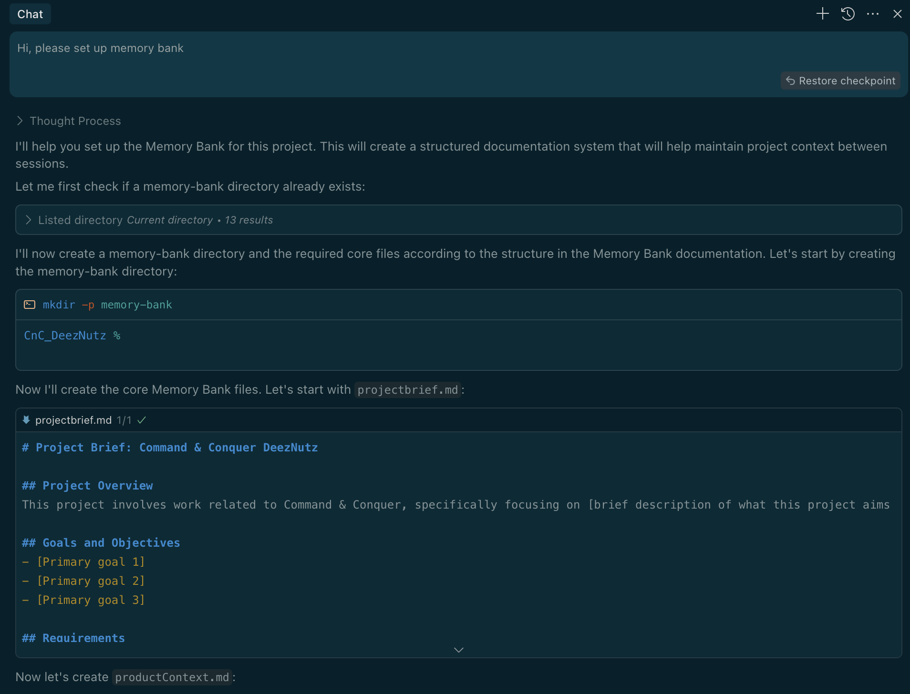
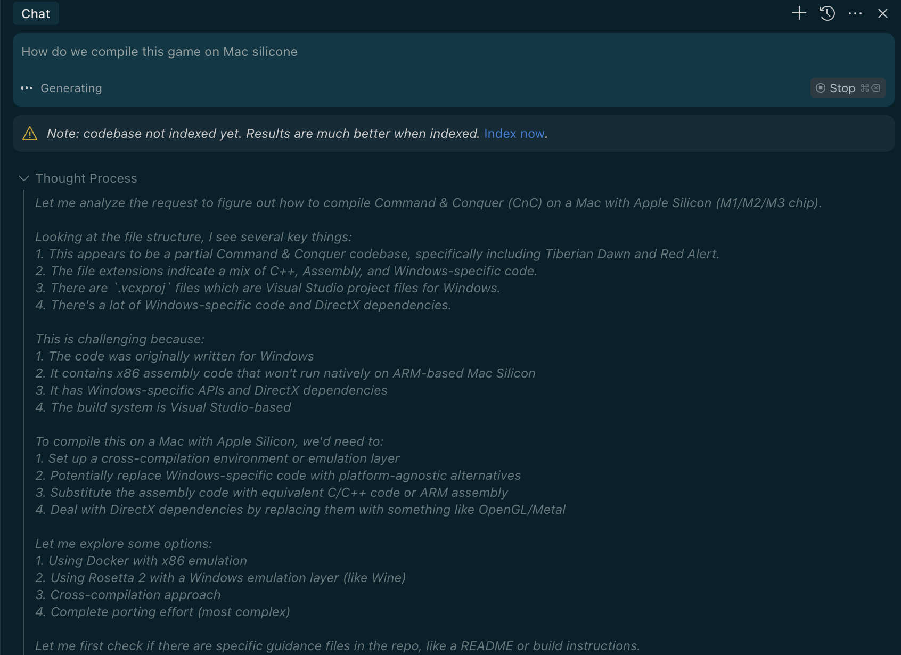

# AeternoAI DevLib 🛠️

> Developer tools and Cursor IDE rules for AeternoAI projects

## Overview

This repository is a storage location for:
1. `.cursor` rules and configurations for the Cursor IDE
2. Development tools that enhance productivity for AeternoAI projects
3. VS Code settings for consistent development environments

## Contents

- **`.cursor/`** - Rules and configurations for Cursor IDE
- **`.devtools/`** - Tools for generating documentation (e.g., README generator)
- **`.scripts/`** - Utility scripts for the repository
- **`.vscode/`** - VS Code editor settings and configurations
- **`.assets/`** - Image assets and examples

## Getting Started

Clone this repository to access the development tools and Cursor IDE configurations:

```bash
git clone https://github.com/AeternoAI/devlib.git
cd devlib
```

## Usage

### Cursor IDE Rules

The `.cursor` directory contains rules and configurations that enhance the Cursor IDE experience. These can be referenced in your projects to maintain consistent AI-assisted development patterns.

### Memory Bank System

The `.cursor/rules/memory-bank.mdc` provides a structured documentation system that helps AI assistants maintain context between sessions. This system creates and manages a set of markdown files that track project information and progress.



The Memory Bank consists of core files organized in a hierarchy:
- `projectbrief.md` - The foundation document for the project
- `productContext.md` - Why the project exists and what problems it solves
- `activeContext.md` - Current work focus and recent changes
- `systemPatterns.md` - System architecture and key technical decisions
- `techContext.md` - Technologies used and technical constraints
- `progress.md` - What works and what's left to build

#### Memory Bank Usage

To effectively use the Memory Bank system with Cursor IDE:

**Key Commands:**
- **"follow your memory bank instructions"** - Instructs Cursor to read the context files and continue where it left off
- **"initialize memory bank"** - Starts a fresh Memory Bank for a new project
- **"update memory bank"** - Triggers a full documentation review and update

**Best Practices:**
- Use **Ask mode** in Cursor IDE for strategy discussions and planning
- Use **Agent mode** in Cursor IDE for implementation tasks
- Let the Memory Bank evolve naturally as your project grows
- Toggle between Edit/Agent modes as needed for different types of tasks
- Maintain regular updates to keep AI context accurate across sessions

This systematic approach ensures AI assistants retain critical project context between sessions, providing consistent and informed assistance throughout your development process.

### File Structure Guide

The `.cursor/rules/structure.mdc` provides a comprehensive file tree view of the repository structure, making it easier for AI assistants to navigate and understand the codebase organization without having to repeatedly scan the file system.



Having this structural information readily available helps:
- **Allows Cursor IDE to quickly and accurately identify the entire structure of the project** without scanning all files
- Quickly identify the location of important files and directories
- Understand the organizational patterns used in the codebase
- Navigate efficiently through complex project hierarchies
- Provide more accurate file path references when making suggestions

### README Generator

The `.devtools` directory contains tools like `generate-readme.md` which provides instructions for generating comprehensive README files for codebases.

### VS Code Settings

The `.vscode/settings.json` file contains optimized editor configurations for:
- Font and text rendering settings
- Visual enhancements for better code readability
- Workbench and UI configurations
- Editor and terminal behavior settings
- File handling preferences

These settings can be used as a reference or directly copied to your projects to ensure a consistent development environment across the organization.

## License

This project is proprietary and confidential. Unauthorized copying, transfer, or reproduction of the contents of this repository is prohibited.

© AeternoAI, All Rights Reserved.
