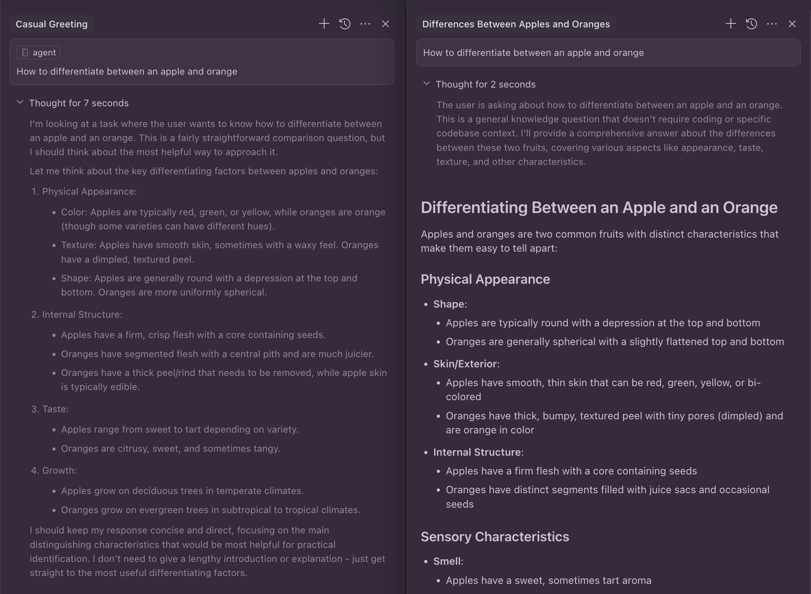

# AeternoAI Repository Template

> Developer productivity tools and enhanced development experience resources for AeternoAI projects

## Overview

This repository is a storage location for:
1. `.cursor` rules and configurations for the Cursor IDE
2. Development tools that enhance productivity for AeternoAI projects
3. VS Code settings for consistent development environments

## Table of Contents

- [AeternoAI Repository Template](#aeternoai-repository-template)
  - [Overview](#overview)
  - [Table of Contents](#table-of-contents)
  - [Contents](#contents)
  - [Getting Started](#getting-started)
    - [Setup Git Ignore](#setup-git-ignore)
  - [Usage](#usage)
    - [Cursor IDE Rules](#cursor-ide-rules)
    - [Memory Bank System](#memory-bank-system)
      - [Memory Bank Usage](#memory-bank-usage)
    - [File Structure Guide](#file-structure-guide)
    - [Advanced Reasoning Rule](#advanced-reasoning-rule)
    - [Developer Tools](#developer-tools)
      - [README Generator](#readme-generator)
      - [Architecture Design Tool](#architecture-design-tool)
      - [System Requirements Specification Creator](#system-requirements-specification-creator)
    - [VS Code Settings](#vs-code-settings)
  - [License](#license)

## Contents

- **`.cursor/`** - Rules and configurations for Cursor IDE
- **`.devtools/`** - Tools for generating documentation and architectural designs
- **`.scripts/`** - Utility scripts for the repository
- **`.vscode/`** - VS Code editor settings and configurations
- **`.assets/`** - Image assets and examples

## Getting Started

Clone this repository to access the development tools and Cursor IDE configurations:

```bash
git clone https://github.com/AeternoAI/aeterno-template-dev.git
cd aeterno-template-dev
```

### Setup Git Ignore

Copy our recommended `.gitignore` configuration:

```bash
# Copy the example .gitignore to your project
cp .gitignore.example .gitignore
```

Or create your own `.gitignore` file with the following content:

```
# Excluded directories
.cursor/
.devtools/
.assets/
.vscode/
.scripts/

# Node.js dependencies
node_modules/
npm-debug.log
yarn-debug.log
yarn-error.log

# Build outputs
dist/
build/
out/

# Environment variables
.env
.env.local
.env.development.local
.env.test.local
.env.production.local

# MacOS specific
.DS_Store

# Log files
*.log

# Editor specific
*.swp
*.swo
.idea/
*.sublime-* 
```

## Usage

The following sections describe the various components of this repository and how to use them effectively in your projects.

### Cursor IDE Rules

The `.cursor` directory contains rules and configurations that enhance the Cursor IDE experience. These can be referenced in your projects to maintain consistent AI-assisted development patterns.

### Memory Bank System

The `.cursor/rules/memory-bank.mdc` provides a structured documentation system that helps AI assistants maintain context between sessions. This system creates and manages a set of markdown files that track project information and progress.


The Memory Bank consists of core files organized in a hierarchy:
- `projectbrief.md` - The foundation document for the project
- `productContext.md` - Why the project exists and what problems it solves
- `activeContext.md` - Current work focus and recent changes
- `systemPatterns.md` - System architecture and key technical decisions
- `techContext.md` - Technologies used and technical constraints
- `progress.md` - What works and what's left to build

#### Memory Bank Usage

To effectively use the Memory Bank system with Cursor IDE:

**Key Commands:**
- **"follow your memory bank instructions"** - Instructs Cursor to read the context files and continue where it left off
- **"initialize memory bank"** - Starts a fresh Memory Bank for a new project
- **"update memory bank"** - Triggers a full documentation review and update

**Best Practices:**
- Use **Ask mode** in Cursor IDE for strategy discussions and planning
- Use **Agent mode** in Cursor IDE for implementation tasks
- Let the Memory Bank evolve naturally as your project grows
- Toggle between Edit/Agent modes as needed for different types of tasks
- Maintain regular updates to keep AI context accurate across sessions

This systematic approach ensures AI assistants retain critical project context between sessions, providing consistent and informed assistance throughout your development process.

### File Structure Guide

The `.cursor/rules/structure.mdc` provides a comprehensive file tree view of the repository structure, making it easier for AI assistants to navigate and understand the codebase organization without having to repeatedly scan the file system.


Having this structural information readily available helps:
- **Allows Cursor IDE to quickly and accurately identify the entire structure of the project** without scanning all files
- Quickly identify the location of important files and directories
- Understand the organizational patterns used in the codebase
- Navigate efficiently through complex project hierarchies
- Provide more accurate file path references when making suggestions

### Advanced Reasoning Rule

The enhanced reasoning methodology in the agent.mdc file provides a rule-based framework that demonstrates significant improvements in thought process and analysis depth, resulting in more thorough and methodical problem-solving.



This comparison showcases:
- Deeper analytical processes with structured reasoning
- More comprehensive consideration of all aspects of a problem
- Enhanced self-questioning and exploratory thinking
- Systematic approach to breaking down complex tasks
- Clear progression from initial impressions to well-reasoned conclusions

The improved reasoning rule ensures more accurate and thorough responses to complex queries, providing better guidance and more reliable solutions.

### Developer Tools

The `.devtools` directory contains specialized tools that enhance the development workflow:

#### README Generator

The `readme-creator.md` provides instructions for generating comprehensive README files for codebases, ensuring consistent documentation across projects.

#### Architecture Design Tool

The `architect.md` provides an advanced architectural planning framework that guides you through designing robust system architectures before implementation begins. Key features include:

- Systematic requirements analysis methodology
- Multi-perspective architectural reasoning
- Design decision frameworks with trade-off analysis
- Technical feasibility assessment
- Structured self-questioning protocols for thorough design validation

This tool helps prevent costly implementation mistakes by ensuring thorough architectural planning with clear reasoning and documentation. The output from this tool includes the Product Requirements Document (PRD) which serves as input for the SRS Creator.

#### System Requirements Specification Creator

The `srs-creator.md` is a powerful tool for translating product requirements into detailed technical specifications. It features:

- Structured analytical frameworks for requirements extraction
- Comprehensive requirement templates for functional and non-functional requirements
- Technical specification frameworks for APIs, data models, and components
- Web search integration for current best practices research
- Validation against trusted technical sources

This tool ensures your System Requirements Specifications are thorough, precise, and aligned with modern development standards. For optimal workflow, use the Architecture Design Tool first to create the PRD, then use the SRS Creator to translate those requirements into technical specifications.

### VS Code Settings

The `.vscode/settings.json` file contains optimized editor configurations for:
- Font and text rendering settings
- Visual enhancements for better code readability
- Workbench and UI configurations
- Editor and terminal behavior settings
- File handling preferences

These settings can be used as a reference or directly copied to your projects to ensure a consistent development environment across the organization.

## License

This project is proprietary and confidential. Unauthorized copying, transfer, or reproduction of the contents of this repository is prohibited.

© AeternoAI, All Rights Reserved.
